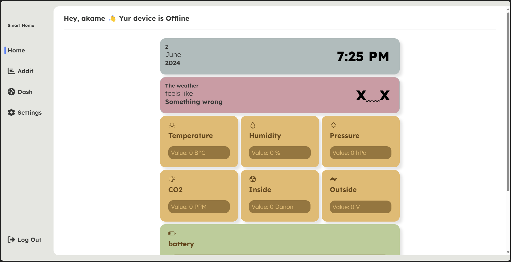

<a name="readme-top"></a>
<a name="Smart Home Monitor"></a>
<br />

<div>
    <div align="center">
        
    </div>

### *Smart Home Monitor*

## 👋Overview

Smart Home Monitor is a web application that allows you to monitor and visualize data from various sensors in your smart home. The application provides real-time updates and includes features such as charts to visualize historical sensor data.

### ✨ Features

- Real-time monitoring of sensor data
- Visualization of sensor data with charts
- Dark and light theme toggle
- User-friendly interface for easy navigation

### Screenshots

<div align="center">
    
</div>

## 👩‍💻 Prerequisites

- Python 3.x
- Flask
- Paho MQTT library (for MQTT integration)

## 🚀 Installation

1. Clone the repository:
   
   ```bash
   git clone https://github.com/badmodest/simple-python-http-server.git
   ```
2. Install dependencies:
   
   ```bash
   pip install -r requirements.txt
   ```
3. Run the application:
   
   ```bash
   python app.py
   ```
4. Apply command Line Arguments
   
   ```bash
   FLAGS:
           --ip <ip>                            IP address to build [default: 127.0.0.1]
           --port <port>                        Port number [default: 5000]
           --silent                             No output to console
           --help                               Guess what)
   ```
5. Access the application in your web browser by default at [http://127.0.0.1:5000/](http://127.0.0.1:5000/)


## License

This project is licensed under the MIT License - see the [LICENSE](LICENSE) file for details.

## Acknowledgments

- [Chart.js](https://www.chartjs.org/) for the charting library
- [Flask](https://flask.palletsprojects.com/) for the web framework
- [Paho MQTT](https://www.eclipse.org/paho/) for MQTT integration


[TODO.md](./TODO.md)

[Back to Top](#readme-top)

